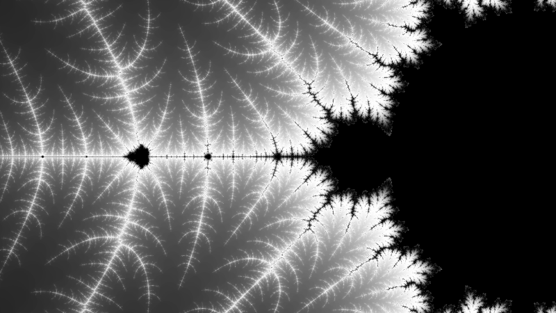

# MbDraw

## Synopsis

This is simple Mandelbrod Drawing App using [angular](https://angular.io/) (to a tiny extend). The (default) color scheme is black and white only and behaves something like [this](https://tinyurl.com/y7bb4tyg)

## Installation & Running the App

1. Clone this
2. Install [angular cli](https://github.com/angular/angular-cli)
3. npm install
4. ng serve
5. [http://localhost:4200](http://localhost:4200)

## Instructions

Some simple rules:
1. Mousewheel Up zoomes in
2. Mousewheel Down zoomes down
3. Mouseclick centeres
4. For own implemenataions of coloring check `colorMaps.ts`
5. Have fun!

## Sample

